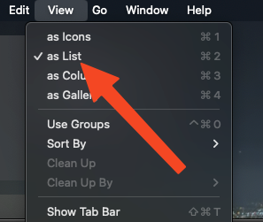
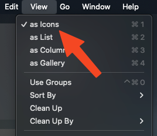
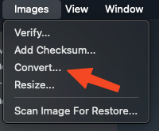
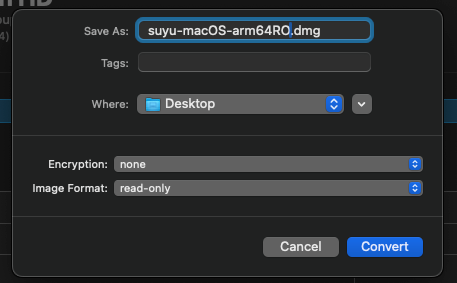
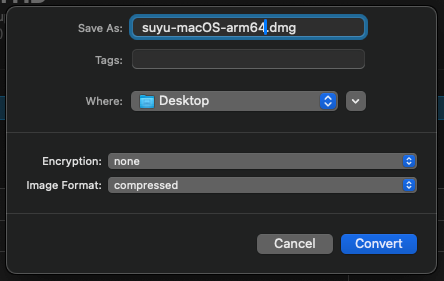
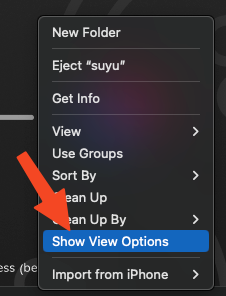
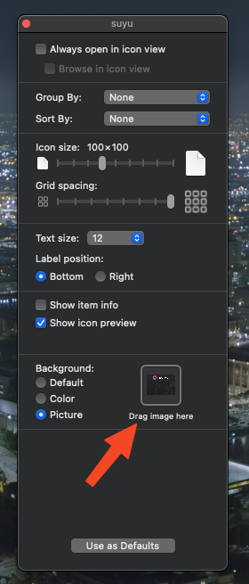

<!--
SPDX-FileCopyrightText: 2024 suyu emulator project
SPDX-License-Identifier: AGPL v3
-->

# MacOS Release Guide

To all the devs, hi. Here is step by step guide for releasing a macOS binary. First of all make sure you have `xcode`, `brew` and `git` installed. Make sure that you have done the first time setup of `xcode`.

Make sure that you have installed requierd dependencies. If not, paste this in terminal:

```
brew install autoconf automake boost ccache ffmpeg fmt glslang hidapi libtool libusb lz4 ninja nlohmann-json openssl pkg-config qt@5 sdl2 speexdsp zlib zlib zstd cmake Catch2 molten-vk vulkan-loader dylibbundler

```

Always do this before doing in a fresh clone of the project:

```
git submodule update --init --recursive
```

(you can skip it and just doing `cd ./build` if you already have build folder inside project folder).

```
mkdir build && cd build
```
For now we are using qt5

```
export Qt5_DIR="/opt/homebrew/opt/qt@5/lib/cmake"
export LIBVULKAN_PATH=/opt/homebrew/lib/libvulkan.dylib
export LLVM_DIR=$(brew --prefix)/opt/llvm@17
export FFMPEG_DIR=$(brew --prefix)/opt/ffmpeg
```

Make sure that you leave `CMAKE_BUILD_TYPE` on `Release` and the minimum macOS should be `macOS 11.0` you can't go lower than that (at least on apple silicon macs). Do not turn on Qt6 for now.

```
cmake .. -GNinja -DCMAKE_BUILD_TYPE=Release -DSUYU_USE_BUNDLED_VCPKG=OFF -DSUYU_TESTS=OFF -DENABLE_WEB_SERVICE=OFF -DENABLE_LIBUSB=OFF -DSDL_ARMNEON=ON -DENABLE_QT6=OFF -DENABLE_QT_TRANSLATION=ON -DSUYU_USE_EXTERNAL_VULKAN_HEADERS=OFF -DCLANG_FORMAT=ON -DCMAKE_OSX_DEPLOYMENT_TARGET=11.0
```

```
ninja
```

```
dylibbundler -of -cd -b -x bin/suyu.app/Contents/MacOS/suyu -d bin/suyu.app/Contents/libs/
```

There is an issue that the `Qt` doesn't get copied to the app so it will crash when someone who doesn't have `Qt` installed.

## Making dmg file

There is a file named `suyu-macOS-arm64raw.dmg`. Open `Disk Utility`. PLEASE DO IN THIS ORDER DO AND MAKE SURE THAT YOU DON'T SKIP ANY OF THIS AND TEST AT THE END.

First thing is you open `suyu-macOS-arm64raw.dmg`. You do this (so it won't get misplaced):



Second, you copy and replace the binary that is from `build/bin` to the mounted drive that we opened up.

Third, you revert view back to icons:



check if everything is alright or not. check the binary is right and check if the binary works.

DO NOT MOVE ANYTHING OR CHANGE THE SIZE OF ANYTHING.

fourth, you have to go to `disk utility` and unmount the disk

fifth is the sensitive part. you have to go to `images->convert` in `disk utility`:



you have to convert the image to `read-only`:



change the name to whatever you want or you can name it the way it is inside the picture.
click on convert.

sixth, you don't have to skip this part. You have to convert the new image (the read-only one) to `compressed` and name it `suyu-macOS-<CPU_ARCHITECTURE>.dmg`:



check the size of the final dmg file and see if you can copy anything into it. It should be read-only and compressed.

## Changing the background of the dmg file

If you want to update the background of the dmg file, first make sure that your image is 540x380 pixels (or you can resize it but don't make the image too big since the pixels you choose will make it bigger or smaller, you can change the aspect ratio but what I recommend is 540x380 pixels).

In the `suyu-macOS-arm64raw.dmg`, right click (control click) on the background. Click on `show view options`:



Inside that you need to drag and drop the image into this place:



### I have a problem

If you have any problems or you want to update this guide, ~~please contact me(AMA25) first in discord.~~

have a good day.
